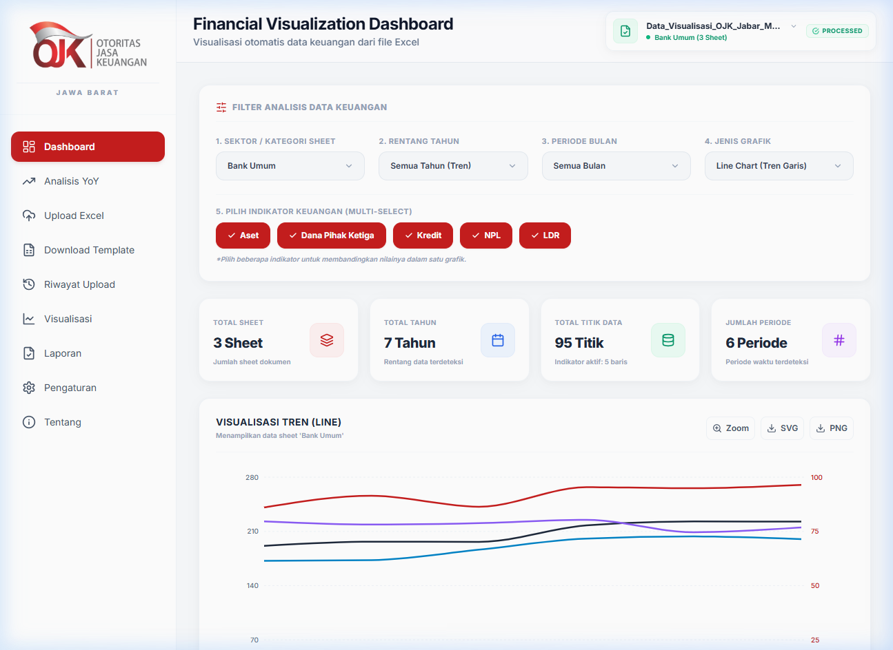

# FINSIGHT 📊 - Financial Data Visualization Dashboard

**FINSIGHT** adalah aplikasi dashboard analisis dan visualisasi data keuangan terintegrasi yang dirancang untuk kebutuhan **Otoritas Jasa Keuangan (OJK) Kantor Regional Jawa Barat**. Aplikasi ini memungkinkan pengguna untuk secara otomatis memproses, menyaring, menganalisis, dan memvisualisasikan data laporan keuangan multi-sektor langsung dari berkas Excel (.xlsx).



---

## ✨ Fitur Utama

- **🚀 Parser Excel Otomatis**: Unggah file Excel (.xlsx) dengan struktur multi-sheet (seperti Bank Umum, BPR, dll) dan sistem akan otomatis memetakan lembar data, kolom tahun, serta indikator keuangan terkait.
- **📈 Visualisasi Interaktif & Dinamis**:
  - Pilihan tipe grafik yang beragam: *Line Chart* (Tren), *Bar Chart* (Perbandingan), *Area Chart* (Akumulasi), *Radar Chart* (Komparasi Indikator), dan *Combination Chart*.
  - Kemampuan ekspor grafik langsung ke format PNG atau SVG dengan satu klik.
- **🔄 Analisis Year-over-Year (YoY)**:
  - Panel analisis pertumbuhan YoY nominal dan persentase untuk indikator-indikator kunci seperti Aset, DPK (Dana Pihak Ketiga), Kredit, NPL (Non-Performing Loan), dan LDR (Loan to Deposit Ratio).
- **📋 Riwayat Unggahan Berkas (Upload History)**:
  - Menyimpan data berkas yang sebelumnya diunggah secara lokal untuk memudahkan akses cepat tanpa perlu mengunggah ulang setiap kali aplikasi dibuka.
- **📥 Download Template Excel**:
  - Menyediakan template Excel standar yang siap diunduh untuk memastikan kompatibilitas format data saat diunggah ke sistem.
- **🎨 Premium UI/UX & Responsive Design**:
  - Menggunakan kombinasi warna profesional khas OJK dengan transisi animasi halus menggunakan Framer Motion.
  - Tampilan yang sepenuhnya responsif dan mendukung navigasi sidebar yang dapat dicollape.

---

## 🛠️ Tech Stack & Dependensi

- **Core Framework**: [Next.js 14](https://nextjs.org/) (React 18) & TypeScript
- **Styling**: [Tailwind CSS](https://tailwindcss.com/) & Vanilla CSS (Desain Modern & Konsisten)
- **Visualisasi/Chart**: [Recharts](https://recharts.org/) (Visualisasi data finansial real-time)
- **Utility / Parsing**:
  - [xlsx (SheetJS)](https://sheetjs.com/) - Parsing data Excel di sisi klien (client-side) secara aman.
  - [Framer Motion](https://www.framer.com/motion/) - Animasi transisi halaman & komponen.
  - [Lucide React](https://lucide.dev/) - Kumpulan ikon modern.

---

## 🚀 Memulai (Quick Start)

Ikuti langkah-langkah di bawah ini untuk menjalankan proyek ini di lingkungan lokal Anda:

### Prerequisites
Pastikan Anda sudah menginstal **Node.js** (versi LTS direkomendasikan) dan npm/yarn di komputer Anda.

### 1. Clone Repositori
```bash
git clone https://github.com/daffataufiq7/projek-visualisasi-excel-OJK.git
cd projek-visualisasi-excel-OJK
```

### 2. Instal Dependensi
Gunakan npm untuk menginstal semua pustaka pendukung:
```bash
npm install
```

### 3. Jalankan Server Pengembangan
Jalankan aplikasi dalam mode development:
```bash
npm run dev
```
Setelah berhasil, buka browser Anda di [http://localhost:3000](http://localhost:3000).

### 4. Build untuk Produksi
Untuk melakukan build produksi aplikasi:
```bash
npm run build
npm run start
```

---

## 📁 Struktur Proyek

```text
├── components/          # Komponen UI modular (Visualisasi, Upload, YoY, dll)
├── hooks/               # Custom hooks React untuk manajemen state dashboard
├── pages/               # Halaman utama Next.js (index.tsx)
├── public/              # Aset statis (gambar, template file Excel)
├── services/            # Logika parsing Excel & kalkulasi finansial
├── styles/              # Global CSS & konfigurasi Tailwind
├── types/               # Definisi tipe TypeScript untuk data dashboard
├── next.config.js       # Konfigurasi Next.js
└── tailwind.config.js   # Konfigurasi utility Tailwind CSS
```

---

## 📊 Format Template Excel
Agar visualisasi berjalan dengan lancar, pastikan berkas Excel yang Anda unggah memiliki struktur kolom berikut:
- **Tahun** (misal: 2018, 2019, dst.)
- **Bulan / Periode** (jika ada)
- Kolom Indikator Keuangan utama:
  - **Aset** (Nominal)
  - **DPK** (Dana Pihak Ketiga)
  - **Kredit** (Nominal)
  - **NPL** (Nominal atau %, misal: 2.5 atau 0.025)
  - **LDR** (Nominal atau %, misal: 80.5 atau 0.805)

*Catatan: Anda dapat mengunduh format template standar langsung melalui menu **Download Template** di dalam aplikasi.*

---

© 2026 Otoritas Jasa Keuangan (OJK) Kantor Regional Jawa Barat.
